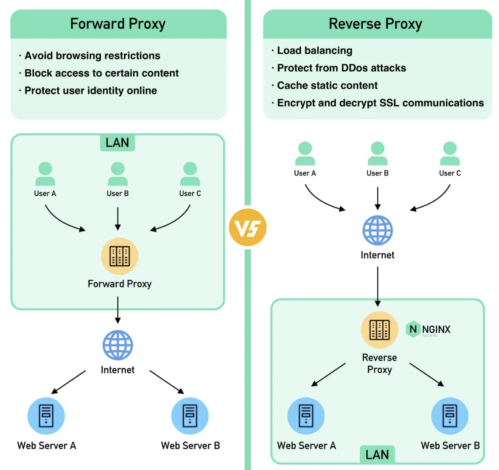
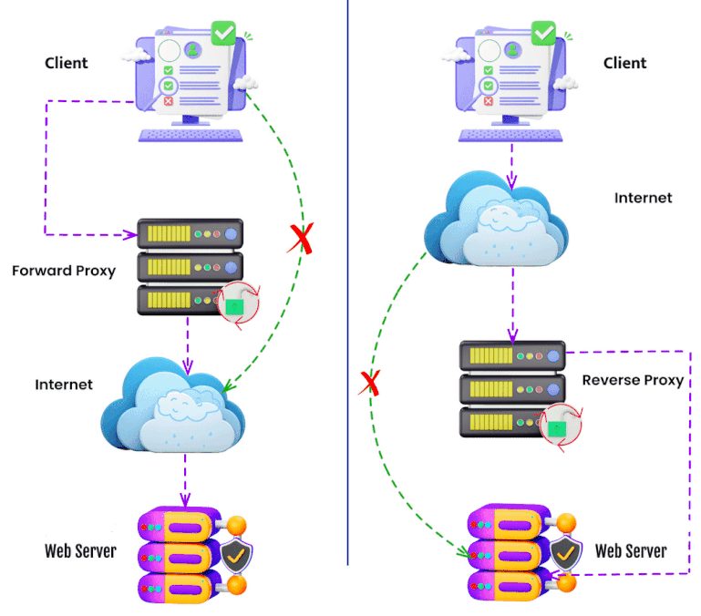

# DEVOPS

DevOps can be defined as a two-pronged methodology that includes a combination of philosophies, tools, and practices related to both software development (“Dev”) and IT operations (“Ops”).

CI And CD — The Backbone Of DevOps

Continuous Integration (CI) is a development practice that requires developers to integrate code into a shared repository several times a day. Each check-in is then verified by an automated build, allowing teams to detect problems early.

Continuous delivery(CD), is a further extension of continuous integration in which software is ready to be released to production at any time. Apart from the automated build and test steps of the continuous integration, continuous delivery also includes fully automated release deployment, thus speeding up the development process even more.

Continuous Deployment (CD) is a software release process that uses automated testing to validate if changes to a codebase are correct and stable for immediate autonomous deployment to a production environment.

## Conatinerization

A container is a standard unit of software that packages up code and all its dependencies so the application runs quickly and reliably from one computing environment to another

### Docker

A Docker container image is a lightweight, standalone, executable package of software that includes everything needed to run an application: code, runtime, system tools, system libraries and settings.

[Docker commands](docker/README.md)

### Kubernetes

Kubernates is a tool for automated management of containerized applications, also known as container orchestration tool.

The name Kubernetes originates from Greek, meaning helmsman or pilot. K8s as an abbreviation results from counting the eight letters between the "K" and the "s".

Kubernates(K8s) is all about managing the containers

## Forward Proxy & Reverse Proxy

A `forward proxy` is a server that sits between user devices and the internet

A `reverse proxy` is a server that accepts a request from the client, forwards the request to web servers, and returns the results to the client as if the proxy server had processed the request.





## GIT

[git commands](git/README.md)

[How to maintain multiple git accounts on a single machine](git/multiple_git_accounts.md)

### SSS Keys 

- To list the fingerprints of all identities currently represented by the SSH agent.

```bash
ssh-add -l
```

- To add a new SSH key to the ssh-agent

```bash
ssh-add ~/.ssh/id_rsa
```

