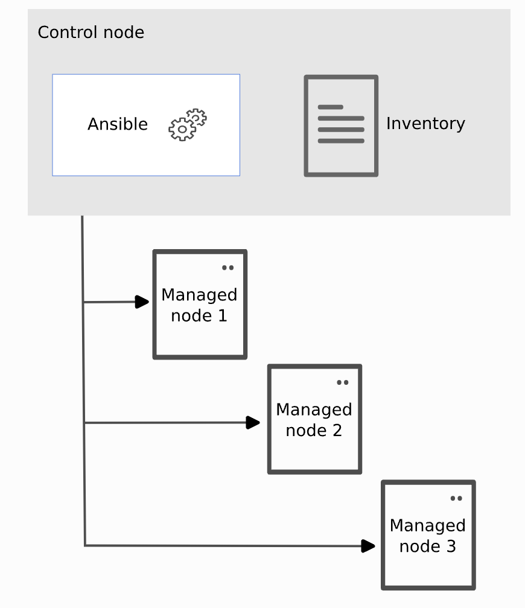
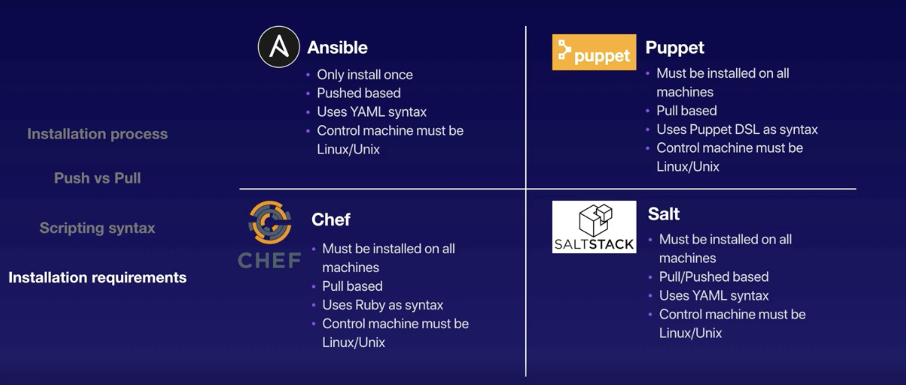

# Ansible

Ansible is a simple IT automation engine that automates cloud provisioning, configuration management, application deployment, intra-service orchestration, and many other IT needs.

Infrastructure as code (IaC) is the process of managing and provisioning computer data centers through machine-readable definition files, rather than physical hardware configuration or interactive configuration tools.

Features of Ansible:

- **Agentless**: Ansible uses SSH and WinRM to connect to any server, so there are no agents or daemons to install and manage.

- **Idempotent**: You can run Ansible tasks multiple times without worrying about the state of the target node. If the desired state of the target node matches the current state, Ansible will do nothing. If the desired state of the target node does not match the current state, Ansible will make the necessary changes to the target node to make it match the desired state.

- **Declarative**: Ansible is a declarative language, meaning that you specify the desired state of the target node, and Ansible will make the necessary changes to the target node to make it match the desired state.

- **Extensible**: Ansible is written in Python, and you can write your own modules in any language you want. Ansible also has a robust plugin system that allows you to extend Ansible's functionality.

- **Secure**: Ansible uses SSH and WinRM to connect to any server, so there are no agents or daemons to install and manage.

- **Simple**: Ansible is a simple language, and it's easy to learn. Ansible is also a simple tool, and it's easy to use.

- **Powerful**: Ansible is a powerful tool, and it's easy to use. Ansible is also a powerful language, and it's easy to learn.

- **Flexible**: Ansible is a flexible tool, and it's easy to use. Ansible is also a flexible language, and it's easy to learn.

- **Fast**: Ansible is a fast tool, and it's easy to use. Ansible is also a fast language, and it's easy to learn.

## Ansible Architecture

Ansible uses a client-server architecture. The client is called the Ansible control node, and the server is called the Ansible managed node.

The Ansible control node is where you run Ansible commands. The Ansible managed node is where you run Ansible playbooks.

Inventory is a list of hosts that Ansible can connect to. Inventory can be static or dynamic. `Node Server` and `Child` are other names for Inventory.

Other tools similar to Ansible:

