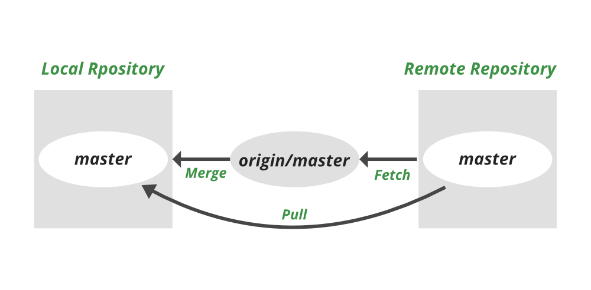

## git commands

### Areas overview

Working Tree

- Current state of files on your filesystem
- Directory tree on your filesystem, that is associated with a git repository

Staging area (Index)

- Files that are staged and ready to be committed
- Area that you can use to prepare commits / temporarily save your work


### git init

This command creates an empty Git repository - basically a .git directory with subdirectories for objects, refs/heads, refs/tags, and template files. An initial HEAD file that references the HEAD of the master branch is also created.

```bash
git init
```

### git clone

To clone a repository into a newly created directory, use git clone with the URL of the repository you want to clone.

```bash
git clone <url>
```

How to clone a specific branch in git?

```bash
git clone -b <branch> <url>
```

or clone all branches

```bash
git clone --all <url>
```

Switch to a specific branch

```bash
git checkout <branch>
```

Create a new branch & switch to it

```bash
git checkout -b <branch>
```

Create a new branch

```bash
git branch <branch>
```

### git remote

To view the short names, such as “origin,” of all specified remote handles.

```bash
git remote -v
```

output

```bash
origin	https://github.com/krishnamohanathota/DEVOPS.git (fetch)
origin	https://github.com/krishnamohanathota/DEVOPS.git (push)
```

### git config

To configure the author name and email address to be used with your commits.

```bash
git config --global user.name "Krishna Mohan Athota"
git config --global user.email "test@gmail.com"
```

### git status

To check the status of the repository. i.e. to check the state between the `repository` and the `working directory`

```bash
git status

On branch main
Your branch is up to date with 'origin/main'.

Changes not staged for commit:
  (use "git add <file>..." to update what will be committed)
  (use "git restore <file>..." to discard changes in working directory)
	modified:   README.md

Untracked files:
  (use "git add <file>..." to include in what will be committed)
	git/

no changes added to commit (use "git add" and/or "git commit -a")
```

### git log

To view the commit history

```bash
git log

commit 345ceadecbf2ec7b780345f822876629de44ac77 (HEAD -> main, origin/main, origin/HEAD)
Author: xxx <xxx@gmail.com>
Date:   Wed Jul 12 18:23:45 2023 +0530

    GIT pull requests

commit 01f1ecd3518a3ddb14c318af10a17ff42c3a624b
Author: xxx <xxx@gmail.com>
Date:   Tue Jul 11 22:00:47 2023 +0530

    GIT branching strategies

commit 9d533782b362dac576fad850b04e83909dad99f4
Author: xxx <xxx@gmail.com>
Date:   Tue Jul 11 21:20:44 2023 +0530

    GIT commands

commit eb3c81d390dab2a3bb9ec9e68a5ff2372659b03d
Author: xxx <xxx@gmail.com>
Date:   Tue Jul 11 21:16:19 2023 +0530

    GIT commands

commit fab0045e4ed0c11563842c64a19e1e15b44ca0fc
Author: xxx <xxx@gmail.com>
Date:   Mon Jul 10 18:55:27 2023 +0530

    Forward Proxy and Reverse Proxy

```

```bash
git log --pretty=oneline

345ceadecbf2ec7b780345f822876629de44ac77 (HEAD -> main, origin/main, origin/HEAD) GIT pull requests
01f1ecd3518a3ddb14c318af10a17ff42c3a624b GIT branching strategies
9d533782b362dac576fad850b04e83909dad99f4 GIT commands
eb3c81d390dab2a3bb9ec9e68a5ff2372659b03d GIT commands
fab0045e4ed0c11563842c64a19e1e15b44ca0fc Forward Proxy and Reverse Proxy
```

```bash
git log --pretty=oneline --max-count=2
git log --pretty=oneline --since='5 minutes ago'
git log --pretty=oneline --until='5 minutes ago'
git log --pretty=oneline --author=<your name>
git log --pretty=oneline --all
```

```bash
git log --all --pretty=format:'%h %cd %s (%an)' --since='7 days ago'

345cea 2023-07-12 GIT pull requests (xxx)
01f1ec 2023-07-11 GIT branching strategies (xxx)
9d5337 2023-07-11 GIT commands (xxx)
eb3c81 2023-07-11 GIT commands (xxx)
fab004 2023-07-10 Forward Proxy and Reverse Proxy (xxx)
```

```bash
git log --pretty=format:'%h %ad | %s%d [%an]' --graph --date=short

* 345cea | GIT pull requests (xxx)
* 01f1ec | GIT branching strategies (xxx)
* 9d5337 | GIT commands (xxx)
* eb3c81 | GIT commands (xxx)
* fab004 | Forward Proxy and Reverse Proxy (xxx)
```

### Alias

- To create an alias for a command

```bash
vi ~/.gitconfig

[alias]
  hist = log --pretty=format:'%h %ad | %s%d [%an]' --graph --date=short
  type = cat-file -t
  dump = cat-file -p
```

```bash
git hist

* 345cea | 2023-07-12 | GIT pull requests (xxx)
* 01f1ec | 2023-07-11 | GIT branching strategies (xxx)
* 9d5337 | 2023-07-11 | GIT commands (xxx)
* eb3c81 | 2023-07-11 | GIT commands (xxx)
* fab004 | 2023-07-10 | Forward Proxy and Reverse Proxy (xxx)
```

### Undo local changes (i.e. “discard changes in working directory”)

- To discard changes in working directory

```bash
git checkout -- README.md
```

### git add (stage a file)

- To add files to the index (i.e., “staging” files)
- To add files to the staging area

```bash
git add README.md
git add git
```

- “README.md” file & "git" folder are now part of the staging area. It is a sort of “save point”; it isn’t yet part of the Git repository, but Git has saved a snapshot of the contents.

```bash
git status

On branch main
Your branch is up to date with 'origin/main'.

Changes to be committed:
  (use "git restore --staged <file>..." to unstage)
	modified:   README.md
	new file:   git/README.md
	new file:   git/images/git-folder.png
	new file:   git/images/git-status.png
```

### git reset (unstage a file)

The reset command resets the staging area to be whatever is in HEAD. This clears the staging area of the change we just staged.

```bash
git reset HEAD README.md

Unstaged changes after reset:

M	README.md
```

### git commit (i.e. “save points”)

- Commits (i.e., “save points”) are created based on what has been added to the index
- To commit changes to local repository.

```bash
git commit -m "GIT commands" --author="Krishna Mohan Athota <krishnamohan.athota@gmail.com>"

[main eb3c81d] GIT commands
 Author: Krishna Mohan Athota <krishnamohan.athota@gmail.com>
 4 files changed, 77 insertions(+)
 create mode 100644 git/README.md
 create mode 100644 git/images/git-folder.png
 create mode 100644 git/images/git-status.png
```

### To update the last commit message

```bash
git commit --amend -m "GIT commands"
```

```bash
git add README.md
git commit --amend -m "GIT commands"
```

Here `Readme.md` file is added to the staging area and then the last commit message is updated.
This means that the last commit message is updated with the new changes.

### Reverse a commit (revert)

- To reverse a commit

```bash
git revert HEAD
```

Since we were undoing the very last commit we made, we were able to use `HEAD` as the argument to revert. We can revert any arbitrary commit earlier in history by simply specifying its `hash value`.

```bash
git revert <commit-hash>
```

```bash
git revert HEAD --no-edit
```

Problem with `git revert` is that it creates a new commit. If you want to undo a commit and pretend it never happened, then you should use `git reset` instead.

### git reset (i.e. “undo commits”)

- To undo commits

```bash

git reset --hard HEAD~1

```

### git push

To push changes to remote repository.

git push <remote> <branch>

<remote> - remote repository name.
<branch> - branch name in remote repository

```bash
git push origin main

Enumerating objects: 10, done.
Counting objects: 100% (10/10), done.
Delta compression using up to 10 threads
Compressing objects: 100% (8/8), done.
Writing objects: 100% (8/8), 457.73 KiB | 38.14 MiB/s, done.
Total 8 (delta 1), reused 0 (delta 0), pack-reused 0
remote: Resolving deltas: 100% (1/1), completed with 1 local object.
To https://github.com/krishnamohanathota/DEVOPS.git
   fab0045..eb3c81d  main -> main
```

### git pull (i.e. “get latest changes”)

To get latest changes from remote repository.

```bash

git pull origin main

* branch            main       -> FETCH_HEAD
   fab0045..eb3c81d  main       -> origin/main
Updating fab0045..eb3c81d
Fast-forward
 README.md | 2 +-
 1 file changed, 1 insertion(+), 1 deletion(-)
```

origin - remote repository name. (origin is the default name for the remote repository). `git remote -v` to view the remote repository names.

main - branch name in remote repository

### git fetch

To get latest changes from remote repository.

```bash

git fetch origin main

From
* branch            main       -> FETCH_HEAD
```

### git pull vs git fetch

- git pull = git fetch + git merge




### What is origin?

- origin is the default name for the remote repository.

- git remote -v to view the remote repository names.

### What is origin/master?

- origin/master is the name of the local copy of the master branch of the remote repository named origin.

- origin/master is not a branch. It is a local copy of a remote branch.

### Rebasing

## git branching strategies

Mainline development (Always be integrating)

- Mainline development is the practice of maintaining a single code line (or branch) for a product.
- Stage, Release and feature branches

This all depends on the size of the team, the size of the project, and the complexity of the project.


### Types of Branches

- Long lived branches

  ```
  - Atleast one long lived branch is required for any project
  - Exist throughout the lifetime of a project
  - No direct commits to these branches
  - Commits only through pull requests. This is to ensure that the code is reviewed by atleast one person. Quality of the code is maintained.
  ```

  - master (Mainline branch)
  - develop
  - staging

- Short lived branches

  ```
  - Created from long lived branches
  - Exist only for a short period of time
  - Created for certain specific purpose and deleted after the purpose is served
  - Direct commits are allowed
  - Merged back to long lived branches
  - Deleted after merging

  - Feature branches
  - Release branches
  - Hotfix branches
  - Experimental branches
  - Bugfix branches
  ```

  - feature
  - release
  - hotfix

### Pull Requests (GITGUB)

- Pull requests are a feature that makes it easier for developers to collaborate using GitHub.
- Pull requests let you tell others about changes you've pushed to a branch in a repository on GitHub.
- Once a pull request is opened, you can discuss and review the potential changes with collaborators and add follow-up commits before your changes are merged into the base branch.

### Merge Requests (GITLAB)

- Merge requests are a feature that makes it easier for developers to collaborate using `GitLab`.
- Merge requests let you tell others about changes you've pushed to a branch in a repository on `GitLab`.
- Once a merge request is opened, you can discuss and review the potential changes with collaborators and add follow-up commits before your changes are merged into the base branch.

### Pull Request (Merge Requests) Process

- Create a branch from the long lived branch
- Make changes to the code
- Commit the changes to the branch
- Create a pull request
- Review the code
- Merge the pull request
- Delete the branch

**_NOTE_** : Pull requests are always for branches, not for individual commits.

### Merge Conflicts

- When Integrating the code from one branch to another branch, if there are any conflicts in the code, then we need to resolve the conflicts manually.

- A merge conflict is an event that occurs when Git is unable to automatically resolve differences in code between two commits.

- When all the changes in the code are in different lines, Git can automatically merge the code.

- When the changes are in the `same line`, Git cannot automatically merge the code. This is called a merge conflict.

- Merge conflicts can be resolved by the developer.

- Merge conflicts can be resolved by the developer by editing the code in the file manually.

```bash
$ git merge develop
CONFLICT (content): Merge conflict in index.html
Automatic merge failed; fix conflicts and then commit the result.
```

You can see that I ran into a conflict here and that Git tells me about the problem right away. Even if I had missed that message, I am reminded about the conflict the next time I type `git status`.


How merge conflicts looks like in the code ?

```html
<<<<<<< HEAD
<h1>My Website</h1>
=======
<h1>My Portfolio</h1>
>>>>>>> develop
```

- The code between `<<<<<<< HEAD` and `=======` is the code that exists in the current branch (i.e. the branch that you are merging into).

- The code between `=======` and `>>>>>>> develop` is the code that exists in the branch that you are merging in (i.e. the branch that you are merging from).

git merge --abort

- To abort the merge process and try again later.
- This will try to reconstruct the pre-merge state of the code.

## References

https://gitimmersion.com/index.html

[Git Internals - How Git Works - Fear Not The SHA!](https://www.youtube.com/watch?v=P6jD966jzlk)

[The Git Merge Handbook](https://www.freecodecamp.org/news/the-definitive-guide-to-git-merge)

[Awesome Git](https://github.com/dictcp/awesome-git)
