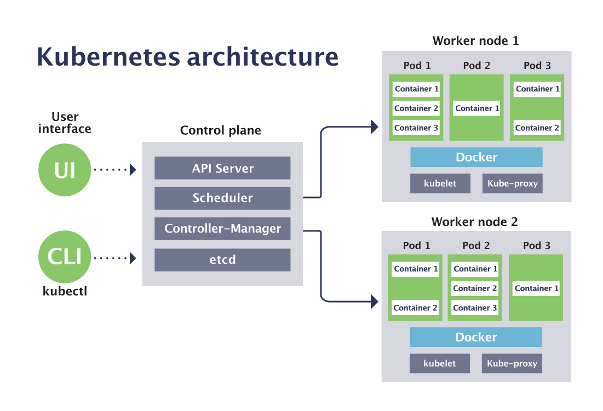

## Kubernates

Kubernates is a tool for automated management of containerized applications, also known as container orchestration tool.

The name Kubernetes originates from Greek, meaning helmsman or pilot. K8s as an abbreviation results from counting the eight letters between the "K" and the "s".

Kubernates(K8s) is all about managing the containers.

<i>Why you need Kubernetes and what it can do ?</i>

Containers are a good way to bundle and run your applications. In a production environment, you need to manage the containers that run the applications and ensure that there is no downtime. For example, if a container goes down, another container needs to start. Wouldn't it be easier if this behavior was handled by a system?

Actually, Kubernetes supports several base container engines, and Docker is just one of them. The two technologies work great together, since `Docker` containers are an efficient way to distribute packaged applications. 

Docker provides a way to encapsulate applications and their dependencies into containers, ensuring consistency across different environments. It simplifies the process of packaging, shipping, and running applications.

While Docker is excellent for containerizing applications, it lacks built-in tools for orchestrating and managing multiple containers in a `distributed environment`. This is where Kubernetes comes in. Kubernetes enables you to automate the deployment, scaling, and operation of application containers. It ensures that containers are deployed in a resilient, scalable, and efficient manner.

Kubernetes provides you with a framework to run distributed systems resiliently. It takes care of scaling and failover for your application, provides deployment patterns, and more.

For example, Kubernetes can easily manage a `canary deployment` for your system. (`canary deployment` refers to a specific deployment strategy in software development and release management. In a canary deployment, a new version of a software application is rolled out to a small subset of users or servers first, before being gradually expanded to a larger audience. This approach is used to test the new version's stability and performance in a real-world environment, and to detect and address any issues or bugs before they affect the entire user base.)

Kubernates makes deploying your containers, monitoring your applications automatically across multiple servers, and scaling your application as simple as a single command. 

<i>What Kubernetes is not ?</i>

Kubernetes is not a traditional, all-inclusive PaaS (Platform as a Service) system. Since Kubernetes operates at the container level rather than at the hardware level, it provides some generally applicable features common to PaaS offerings, such as deployment, scaling, load balancing, and lets users integrate their logging, monitoring, and alerting solutions. However, Kubernetes is not monolithic, and these default solutions are optional and pluggable.

<i>Kubernetes Architecture</i>

## Control plane / Master Node (Virtual Machine)

The `master node` is the one that has all the components of the Kubernetes control plane running on it. You can also set up multiple master nodes for `high availability`.

The Kubernetes control plane is the main entry point for administrators and users to manage the various nodes. Operations are issued to it either through HTTP calls or connecting to the machine and running command-line scripts. As the name implies, it controls how Kubernetes interacts with your applications.

### API Server
The API server exposes a REST interface to the Kubernetes cluster. All operations against pods, services, and so forth, are executed programmatically by communicating with the endpoints provided by it.

### Scheduler
The scheduler is responsible for assigning work to the various nodes. It keeps watch over the resource capacity and ensures that a worker node’s performance is within an appropriate threshold.

- Watches for newly created pods with no assigned node, and selects a node for them to run on.

### Controller manager (Kube-controller-manager)
The controller-manager is responsible for making sure that the shared state of the cluster is operating as expected. More accurately, the controller manager oversees various controllers which respond to events (e.g., if a `node goes down`).

### etcd
etcd is a distributed key-value store that Kubernetes uses to store all of its data. It’s a simple database that can be queried to retrieve all of the information about the cluster’s state.

### Cloud-controller-manager

The cloud-controller-manager is a Kubernetes control plane component that embeds cloud-specific control logic. 

- Knows how to talk to the underlying cloud provider (AWS, GCP, Azure, etc) and make use of the services it offers.

## Worker Node (Virtual Machine)

A Kubernetes node manages and runs pods; it’s the machine (whether virtualized or physical) that performs the given work. Just as pods collect individual containers that operate together, a node collects entire pods that function together.

- Its not task specific, it can run totally different containers.
- It is managed by the master node.

### Kubelet
A Kubelet tracks the state of a pod to ensure that all the containers are running. It provides a `heartbeat` message every few seconds to the control plane. If a replication controller does not receive that message, the node is marked as `unhealthy`.

- It is the agent that runs on each node in the cluster. It makes sure that containers are running in a pod.
- Comunication bwteen master and worker nodes.
- API server is the only component that communicates with the kubelet.

### Kube proxy
The Kube proxy routes traffic coming into a node from the service. It also handles the routing of traffic between containers on the same node.

- Managed node and pod network communication.

## POD (Container)

A Kubernetes pod is a group of containers, and is the smallest unit that Kubernetes administers. Pods have a single IP address that is applied to every container within the pod. Containers in a pod share the same resources such as memory and storage. 

Pods are ephemeral, which means that they are not designed to be persistent. If a pod is deleted, its IP address is released and the pod is not restarted. Pods are designed to be created, used, and discarded.

Kubernetes doesn’t treat its pods as unique, long-running instances; if a pod encounters an issue and dies, it’s Kubernetes job to replace it so that the application doesn’t experience any downtime.

pod executes the containers in it. i.e. just running the `docker run` command.

## Kubernates Cluster

A cluster is all of the above components put together as a single unit.

## kubectl (Kubernates CLI)

kubectl is a command-line tool that allows you to run commands against Kubernetes clusters. You can use kubectl to deploy applications, inspect and manage cluster resources, and view logs.

<i>What you need to do vs Kubernates will do</i>

| What you need to do | What Kubernates will do |
| --- | --- |
| Creates Cluster & Node Instances (Worker + Master Noes) | Create your Objects (pods) and manage them |
| Setup API Server, Kubelet and other Kubernates services / Software on Nodes | Monitor pods and re-create them, Scale pods etc|
| Create other (cloud) resources like Load Balancer, Storage etc | Utlizes the provided (cloud) resources to apply your configuration / goals |

<i>References</i>

Kubernetes Tutorials

https://www.aquasec.com/cloud-native-academy/kubernetes-101/kubernetes-tutorials-2/

