- [Kubernetes](#kubernetes)
  - [Why you need Kubernetes and what it can do ?](#why-you-need-kubernetes-and-what-it-can-do-)
  - [What Kubernetes is not ?](#what-kubernetes-is-not-)
  - [Kubernetes Architecture](#kubernetes-architecture)
    - [Control plane / Master Node (Virtual Machine)](#control-plane--master-node-virtual-machine)
      - [API Server](#api-server)
      - [Scheduler](#scheduler)
      - [Controller manager (Kube-controller-manager)](#controller-manager-kube-controller-manager)
      - [etcd](#etcd)
      - [Cloud-controller-manager](#cloud-controller-manager)
    - [Worker Node (Virtual Machine)](#worker-node-virtual-machine)
      - [Kubelet](#kubelet)
      - [Kube proxy](#kube-proxy)
    - [POD (Container)](#pod-container)
    - [Kubernetes Cluster](#kubernetes-cluster)
    - [kubectl (Kubernetes CLI)](#kubectl-kubernetes-cli)
    - [What you need to do vs Kubernetes will do](#what-you-need-to-do-vs-kubernetes-will-do)
  - [Installation](#installation)
    - [Install kubectl](#install-kubectl)
  - [Commands](#commands)
    - [minikube start](#minikube-start)
    - [kubectl cluster-info](#kubectl-cluster-info)
    - [minikube status](#minikube-status)
    - [minikube dashboard](#minikube-dashboard)
  - [Deployment](#deployment)
    - [Deployment Object](#deployment-object)
    - [POD Object](#pod-object)
    - [Service Object](#service-object)
    - [Deployment - Imperative](#deployment---imperative)
      - [Deployment - Create](#deployment---create)
        - [STEP #1: Create a simple Docker image](#step-1-create-a-simple-docker-image)
        - [STEP #2: Create a Deployment](#step-2-create-a-deployment)
        - [STEP #3: Push Docker Image to Docker Hub](#step-3-push-docker-image-to-docker-hub)
        - [STEP #4: Create a Deployment with a valid image](#step-4-create-a-deployment-with-a-valid-image)
        - [STEP #5: Create a Service (Expose a deployment with a service)](#step-5-create-a-service-expose-a-deployment-with-a-service)
          - [minikube service](#minikube-service)
        - [STEP #6: Scale the application](#step-6-scale-the-application)
          - [kubectl scale deployment](#kubectl-scale-deployment)
      - [Deployment - Update](#deployment---update)
        - [STEP #1: Update the application](#step-1-update-the-application)
        - [STEP #2: Update the deployment](#step-2-update-the-deployment)
          - [How to get correct container name in the pod?](#how-to-get-correct-container-name-in-the-pod)
      - [Deployment - Rollback](#deployment---rollback)
        - [STEP #1: Update the application with a WRONG image](#step-1-update-the-application-with-a-wrong-image)
        - [STEP#2  : Rollback the deployment](#step2---rollback-the-deployment)
        - [STEP#3 : Rollback to a specific revision](#step3--rollback-to-a-specific-revision)
        - [STEP#4 : Rollback to a specific revision](#step4--rollback-to-a-specific-revision)
      - [Deployment - Delete](#deployment---delete)
        - [STEP #1: Delete the service](#step-1-delete-the-service)
        - [STEP #2: Delete the deployment](#step-2-delete-the-deployment)
    - [Deployment - Declarative](#deployment---declarative)
      - [Deployment file](#deployment-file)
        - [deployment.yml](#deploymentyml)
          - [Description of YAML fields](#description-of-yaml-fields)
      - [Selectors](#selectors)
        - [Why selector is required?](#why-selector-is-required)
        - [Updated file with `selector` field](#updated-file-with-selector-field)
      - [Service](#service)
        - [Why service is required?](#why-service-is-required)
        - [Service file](#service-file)
        - [service.yml](#serviceyml)
      - [Update the deployment](#update-the-deployment)
      - [Delete the deployment and service](#delete-the-deployment-and-service)
      - [Single fle for deployment and service](#single-fle-for-deployment-and-service)
        - [deployment-master.yml](#deployment-masteryml)
  - [Probes](#probes)
    - [Liveness Probe](#liveness-probe)
    - [Readiness Probe](#readiness-probe)
  - [References](#references)


# Kubernetes

Kubernetes is a tool for automated management of containerized applications, also known as container orchestration tool.

The name Kubernetes originates from Greek, meaning helmsman or pilot. K8s as an abbreviation results from counting the eight letters between the "K" and the "s".

Kubernetes(K8s) is all about managing the containers.

<details>
<summary><i>Why you need Kubernetes and what it can do ?</i></summary>

## Why you need Kubernetes and what it can do ?

Containers are a good way to bundle and run your applications. In a production environment, you need to manage the containers that run the applications and ensure that there is no downtime. For example, if a container goes down, another container needs to start. Wouldn't it be easier if this behavior was handled by a system?

Actually, Kubernetes supports several base container engines, and Docker is just one of them. The two technologies work great together, since `Docker` containers are an efficient way to distribute packaged applications. 

Docker provides a way to encapsulate applications and their dependencies into containers, ensuring consistency across different environments. It simplifies the process of packaging, shipping, and running applications.

While Docker is excellent for containerizing applications, it lacks built-in tools for orchestrating and managing multiple containers in a `distributed environment`. This is where Kubernetes comes in. Kubernetes enables you to automate the deployment, scaling, and operation of application containers. It ensures that containers are deployed in a resilient, scalable, and efficient manner.

Kubernetes provides you with a framework to run distributed systems resiliently. It takes care of scaling and failover for your application, provides deployment patterns, and more.

For example, Kubernetes can easily manage a `canary deployment` for your system. (`canary deployment` refers to a specific deployment strategy in software development and release management. In a canary deployment, a new version of a software application is rolled out to a small subset of users or servers first, before being gradually expanded to a larger audience. This approach is used to test the new version's stability and performance in a real-world environment, and to detect and address any issues or bugs before they affect the entire user base.)

Kubernetes makes deploying your containers, monitoring your applications automatically across multiple servers, and scaling your application as simple as a single command. 

</details>


<details>
<summary><i>What Kubernetes is not ?</i></summary>

## What Kubernetes is not ?

Kubernetes is not a traditional, all-inclusive PaaS (Platform as a Service) system. Since Kubernetes operates at the container level rather than at the hardware level, it provides some generally applicable features common to PaaS offerings, such as deployment, scaling, load balancing, and lets users integrate their logging, monitoring, and alerting solutions. However, Kubernetes is not monolithic, and these default solutions are optional and pluggable.

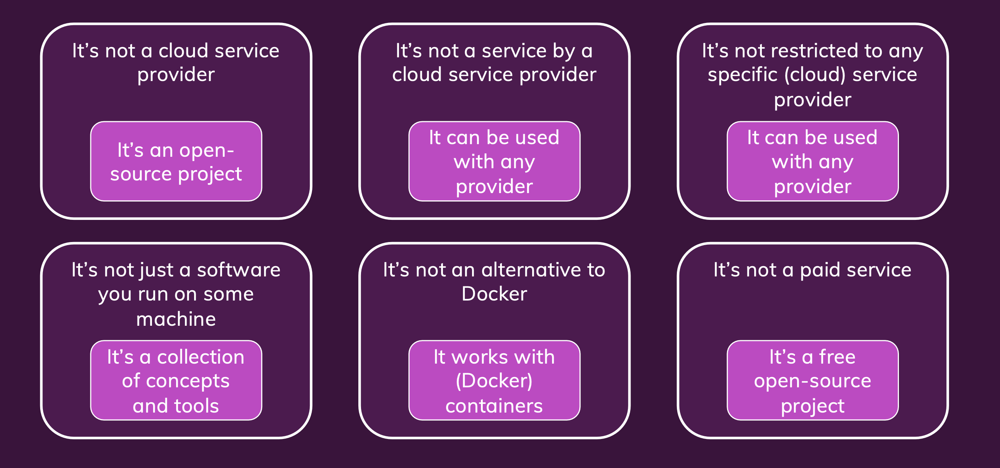

</details>

<details>
<summary><i>Kubernetes Architecture</i></summary>

## Kubernetes Architecture


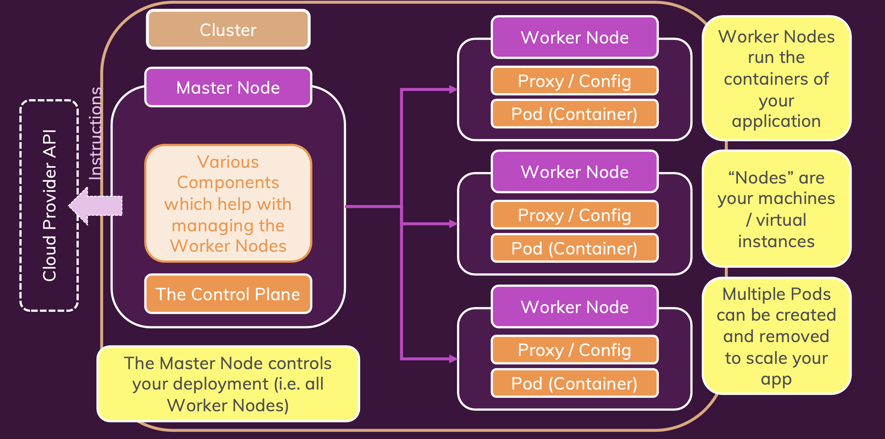

### Control plane / Master Node (Virtual Machine)

The `master node` is the one that has all the components of the Kubernetes control plane running on it. You can also set up multiple master nodes for `high availability`.

The Kubernetes control plane is the main entry point for administrators and users to manage the various nodes. Operations are issued to it either through HTTP calls or connecting to the machine and running command-line scripts. As the name implies, it controls how Kubernetes interacts with your applications.

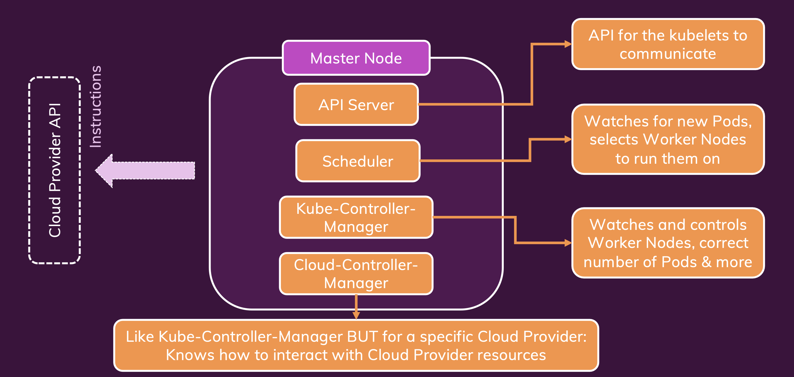

#### API Server
The API server exposes a REST interface to the Kubernetes cluster. All operations against pods, services, and so forth, are executed programmatically by communicating with the endpoints provided by it.

#### Scheduler
The scheduler is responsible for assigning work to the various nodes. It keeps watch over the resource capacity and ensures that a worker node’s performance is within an appropriate threshold.

- Watches for newly created pods with no assigned node, and selects a node for them to run on.

#### Controller manager (Kube-controller-manager)
The controller-manager is responsible for making sure that the shared state of the cluster is operating as expected. More accurately, the controller manager oversees various controllers which respond to events (e.g., if a `node goes down`).

#### etcd
etcd is a distributed key-value store that Kubernetes uses to store all of its data. It’s a simple database that can be queried to retrieve all of the information about the cluster’s state.

#### Cloud-controller-manager

The cloud-controller-manager is a Kubernetes control plane component that embeds cloud-specific control logic. 

- Knows how to talk to the underlying cloud provider (AWS, GCP, Azure, etc) and make use of the services it offers.

### Worker Node (Virtual Machine)

A Kubernetes node manages and runs pods; it’s the machine (whether virtualized or physical) that performs the given work. Just as pods collect individual containers that operate together, a node collects entire pods that function together.

- Its not task specific, it can run totally different containers.
- It is managed by the master node.

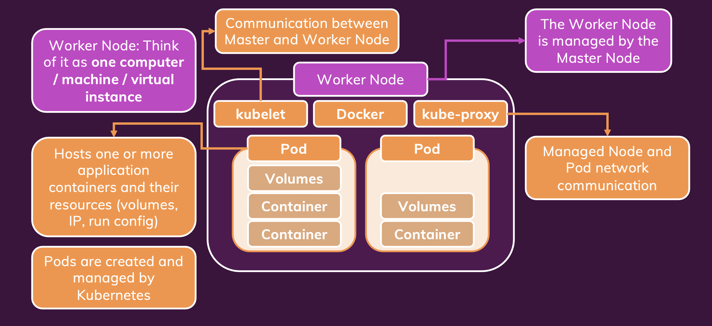

#### Kubelet
A Kubelet tracks the state of a pod to ensure that all the containers are running. It provides a `heartbeat` message every few seconds to the control plane. If a replication controller does not receive that message, the node is marked as `unhealthy`.

- It is the agent that runs on each node in the cluster. It makes sure that containers are running in a pod.
- Comunication bwteen master and worker nodes.
- API server is the only component that communicates with the kubelet.

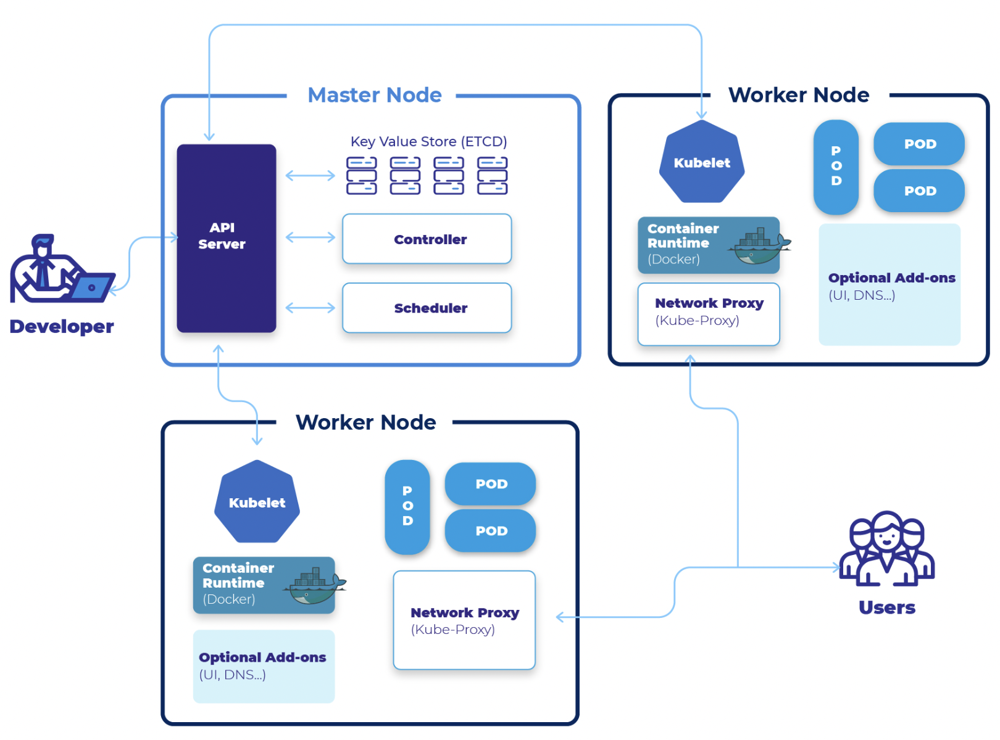

#### Kube proxy
The Kube proxy routes traffic coming into a node from the service. It also handles the routing of traffic between containers on the same node.

- Managed node and pod network communication.

### POD (Container)

A Kubernetes pod is a group of containers, and is the smallest unit that Kubernetes administers. Pods have a single IP address that is applied to every container within the pod. Containers in a pod share the same resources such as memory and storage. 

Pods are ephemeral, which means that they are not designed to be persistent. If a pod is deleted, its IP address is released and the pod is not restarted. Pods are designed to be created, used, and discarded.

Kubernetes doesn’t treat its pods as unique, long-running instances; if a pod encounters an issue and dies, it’s Kubernetes job to replace it so that the application doesn’t experience any downtime.

pod executes the containers in it. i.e. just running the `docker run` command.

### Kubernetes Cluster

A cluster is all of the above components put together as a single unit.

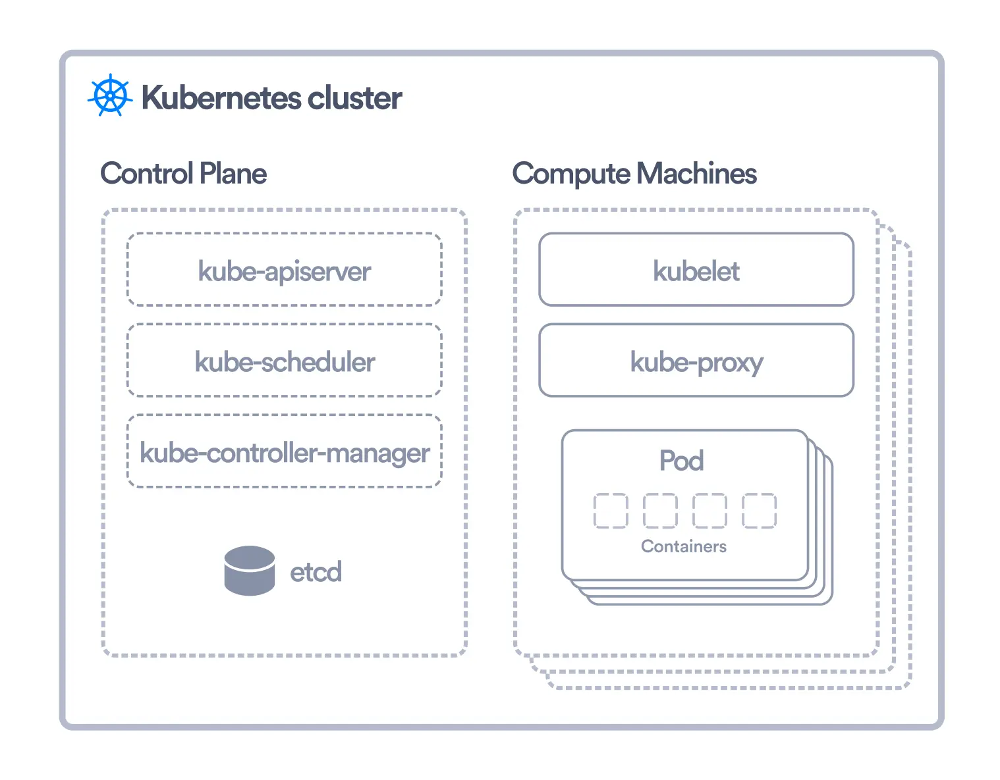

### kubectl (Kubernetes CLI)

kubectl is a command-line tool that allows you to run commands against Kubernetes clusters. You can use kubectl to deploy applications, inspect and manage cluster resources, and view logs.

</details>

<details>
<summary><i>What you need to do vs Kubernetes will do</i></summary>

### What you need to do vs Kubernetes will do

| What you need to do | What Kubernetes will do |
| --- | --- |
| Creates Cluster & Node Instances (Worker + Master Noes) | Create your Objects (pods) and manage them |
| Setup API Server, Kubelet and other Kubernetes services / Software on Nodes | Monitor pods and re-create them, Scale pods etc|
| Create other (cloud) resources like Load Balancer, Storage etc | Utlizes the provided (cloud) resources to apply your configuration / goals |

</details>


<details>
<summary><i>Installation</i></summary>

## Installation

### Install kubectl

https://kubernetes.io/docs/tasks/tools/

</details>


<details>
<summary><i>Commands</i></summary>

## Commands

```
kubectl version --client

Client Version: v1.29.1
Kustomize Version: v5.0.4-0.20230601165947-6ce0bf390ce3
```
### minikube start

**`minikube start` (i.e. Minikube with the Docker driver)**

-  It initializes and starts a single-node Kubernetes cluster.
-  Minikube can use various virtualization drivers such as VirtualBox, VMware, HyperKit, KVM, etc., to create a virtual machine (VM) that will host the Kubernetes cluster. If a VM is used, minikube start will create and configure the VM to run the Kubernetes components.
-  By default, Minikube uses the Docker driver. If you have Docker installed and running, you can use it to start Minikube.
-  With the Docker `driver`, Minikube provides a lightweight way to run a local Kubernetes cluster by leveraging Docker containers.
-  Pull Kubernetes Images: Minikube pulls the necessary Docker images for the specific version of Kubernetes that you are running. These images include the control plane components (API server, controller manager, scheduler) and other components required for running a Kubernetes cluster.
-  Containerized Kubernetes Components: when using Minikube with the Docker driver, the Kubernetes components (control plane and node) run within Docker containers, but not necessarily as separate containers for each component. Instead, the components run as processes within the same Docker containers. This setup is more compact and suitable for local development environments.
-  Networking Configuration: Minikube configures the networking for the cluster, ensuring that the containers can communicate with each other. It sets up a local DNS to enable service discovery within the cluster.
-  Kubeconfig Configuration: Minikube updates your kubectl configuration (kubeconfig) to point to the newly created cluster. This ensures that when you run kubectl commands, they interact with the local Minikube cluster.

**NOTE**
- Before running the above command, make sure `docker` is running.
  
```
minikube start

😄  minikube v1.26.0 on Darwin 13.4.1 (arm64)
✨  Using the docker driver based on existing profile
👍  Starting control plane node minikube in cluster minikube
🚜  Pulling base image ...
🔄  Restarting existing docker container for "minikube" ...
🐳  Preparing Kubernetes v1.24.1 on Docker 20.10.17 ...
🔎  Verifying Kubernetes components...
    ▪ Using image gcr.io/k8s-minikube/storage-provisioner:v5
🌟  Enabled addons: storage-provisioner, default-storageclass

❗  /usr/local/bin/kubectl is version 1.29.1, which may have incompatibilites with Kubernetes 1.24.1.
    ▪ Want kubectl v1.24.1? Try 'minikube kubectl -- get pods -A'
🏄  Done! kubectl is now configured to use "minikube" cluster and "default" namespace by default

```

```
docker ps

CONTAINER ID   IMAGE                                 COMMAND                  CREATED        STATUS         PORTS                                                                                                                        NAMES
329a3d2451de   gcr.io/k8s-minikube/kicbase:v0.0.32   "/usr/local/bin/entr…"   3 months ago   Up 2 minutes   0.0.0.0:59487->22/tcp, 0.0.0.0:59490->2376/tcp, 0.0.0.0:59492->5000/tcp, 0.0.0.0:59493->8443/tcp, 0.0.0.0:59491->32443/tcp   minikube

```

### kubectl cluster-info

```
kubectl cluster-info

Kubernetes control plane is running at https://127.0.0.1:59493
CoreDNS is running at https://127.0.0.1:59493/api/v1/namespaces/kube-system/services/kube-dns:dns/proxy

To further debug and diagnose cluster problems, use 'kubectl cluster-info dump'.
```

### minikube status
```
minikube status

minikube
type: Control Plane
host: Running
kubelet: Running
apiserver: Running
kubeconfig: Configured
```

### minikube dashboard
```
minikube dashboard
🔌  Enabling dashboard ...
    ▪ Using image kubernetesui/dashboard:v2.6.0
    ▪ Using image kubernetesui/metrics-scraper:v1.0.8
🤔  Verifying dashboard health ...
🚀  Launching proxy ...
🤔  Verifying proxy health ...
🎉  Opening http://127.0.0.1:62368/api/v1/namespaces/kubernetes-dashboard/services/http:kubernetes-dashboard:/proxy/ in your default browser...

```

</details>


<details>
<summary><i>Deployment</i></summary>

## Deployment

- A `deployment` is a Kubernetes `object` that defines how to create and update instances of your application.

### Deployment Object

A `deployment` is a Kubernetes `object` that defines how to create and update instances of your application. Once you’ve created a deployment, the Kubernetes master schedules mentioned application instances onto individual Nodes in the cluster. Once the application instances are created, a Kubernetes Deployment Controller continuously monitors those instances. If the Node hosting an instance goes down or is deleted, the Deployment controller replaces the instance with an instance on another Node in the cluster. This provides a self-healing mechanism to address machine failure or maintenance.

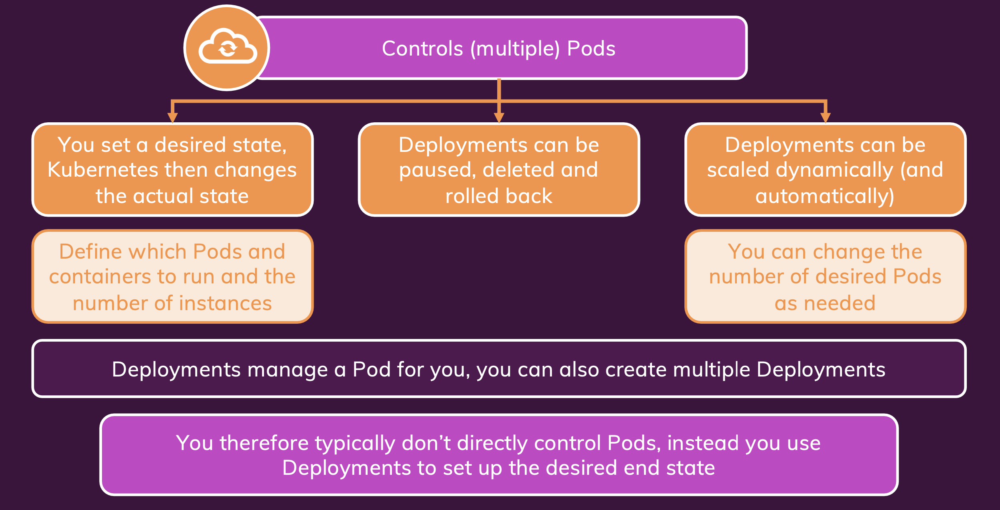

### POD Object

A `pod` is a Kubernetes `object` that represents a group of one or more application containers (such as Docker or rkt), and some shared resources for those containers. Those resources include:

  - Shared storage, as Volumes
  - Networking, as a unique cluster IP address
  - Information about how to run each container, such as the container image version or specific ports to use
  - A pod is the basic building block of Kubernetes–the smallest and simplest unit in the Kubernetes object model that you create or deploy. A pod represents a running process on your cluster.

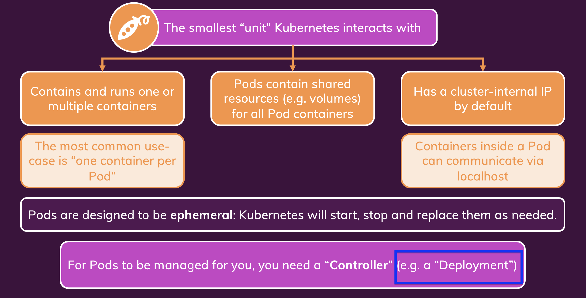

### Service Object

A `service` is a Kubernetes `object` that exposes an application running on a set of Pods as a network service.

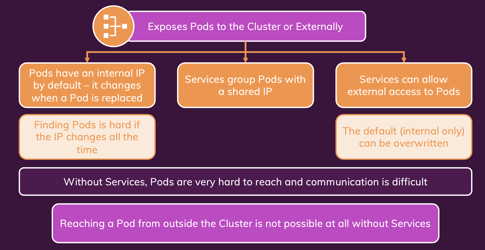

</details>

<details>
<summary><i>Deployment - Imperative</i></summary>

### Deployment - Imperative

<details>
<summary><i>Deployment - Create</i></summary>

#### Deployment - Create

##### STEP #1: Create a simple Docker image

[Simple NodeJS Docker Application](./sample-nodejs-app/Readme.md)

##### STEP #2: Create a Deployment

```
docker images
REPOSITORY                                                                  TAG         IMAGE ID       CREATED          SIZE
nodejs-app                                                                  latest      f9d5cd5a0171   26 minutes ago   861MB

kubectl create deployment first-app --image=nodejs-app

deployment.apps/first-app created
```

```
kubectl get deployments 
NAME        READY   UP-TO-DATE   AVAILABLE   AGE
first-app   0/1     1            0           3m13s

kubectl get pods
NAME                         READY   STATUS             RESTARTS   AGE
first-app-7748f564d4-fx6fs   0/1     ImagePullBackOff   0          3m39s
```

kubectl was unable to find the image locally, so it tried to download the image from a remote repository. However, the image was not found in the remote repository either, so the pod is stuck in the ImagePullBackOff state.

```
kubectl delete deployment first-app

deployment.apps "first-app" deleted
```

##### STEP #3: Push Docker Image to Docker Hub

```
docker login

docker tag nodejs-app <docker-hub-username>/nodejs-app

docker push <docker-hub-username>/nodejs-app
```

##### STEP #4: Create a Deployment with a valid image

``` 
kubectl create deployment first-app --image=<docker-hub-username>/nodejs-app

kubectl get pods
NAME                         READY   STATUS              RESTARTS   AGE
first-app-675d7b94f6-zhfq2   0/1     ContainerCreating   0          4s

kubectl get pods
NAME                         READY   STATUS    RESTARTS   AGE
first-app-675d7b94f6-zhfq2   1/1     Running   0          29s

kubectl get deployments 
NAME        READY   UP-TO-DATE   AVAILABLE   AGE
first-app   1/1     1            1           92s
```

```
minikube dashboard
```

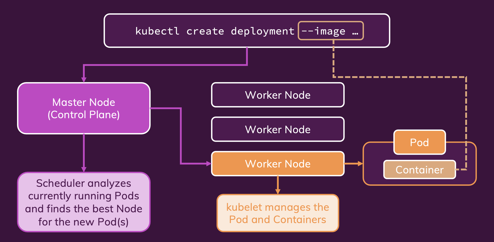

##### STEP #5: Create a Service (Expose a deployment with a service)

```
kubectl get services
NAME         TYPE        CLUSTER-IP   EXTERNAL-IP   PORT(S)   AGE
kubernetes   ClusterIP   10.96.0.1    <none>        443/TCP   97d
```

Above `kubernetes` service is created by default when you create a cluster. It is used by the internal components of Kubernetes, and is not meant to be used by applications running on the cluster.


```
kubectl expose deployment first-app --type=LoadBalancer --port=8181

service/first-app exposed
```

```
kubectl get services

NAME         TYPE           CLUSTER-IP       EXTERNAL-IP   PORT(S)          AGE
first-app    LoadBalancer   10.109.121.166   <pending>     8181:32446/TCP   15s
kubernetes   ClusterIP      10.96.0.1        <none>        443/TCP          97d

```

If we would have created the cluster on a cloud provider like AWS, Azure, GCP etc, then the `EXTERNAL-IP` would have been assigned by the cloud provider. Since we are using `minikube`, EXTENAL-IP is always `<pending>`.

###### minikube service

```
minikube service first-app


|-----------|---------------|-------------|---------------------------|
| NAMESPACE |     NAME      | TARGET PORT |            URL            |
|-----------|---------------|-------------|---------------------------|
| default   | first-app |        8181     | http://192.168.49.2:32446 |
|-----------|---------------|-------------|---------------------------|
🏃  Starting tunnel for service first-app-new.
|-----------|---------------|-------------|------------------------|
| NAMESPACE |     NAME      | TARGET PORT |          URL           |
|-----------|---------------|-------------|------------------------|
| default   | first-app     |             | http://127.0.0.1:49421 |
|-----------|---------------|-------------|------------------------|
🎉  Opening service default/first-app-new in default browser...
❗  Because you are using a Docker driver on darwin, the terminal needs to be open to run it.

```

Browser will open with the URL `http://127.0.0.1:49421/` and you will see the output of the application.

- When you expose a deployment with the LoadBalancer type, Minikube simulates the behavior of an external load balancer. However, since Minikube runs on a local environment, it doesn't have access to external load balancers.

- Minikube starts a `tunnel` to expose the specified service to your local machine. The tunnel allows you to access the service as if it were running locally on your computer. This is especially useful when working with `services of type LoadBalancer` in a Minikube environment.

- Keep in mind that this behavior is specific to Minikube, and in a production environment, you would typically have an external load balancer handling the traffic to services of type LoadBalancer.

##### STEP #6: Scale the application

###### kubectl scale deployment
```
kubectl scale deployment first-app --replicas=3

deployment.apps/first-app scaled
```

```
kubectl get pods
NAME                         READY   STATUS    RESTARTS      AGE
first-app-675d7b94f6-nwkf8   1/1     Running   0             11s
first-app-675d7b94f6-vwzw5   1/1     Running   0             11s
first-app-675d7b94f6-zhfq2   1/1     Running   3 (16m ago)   4h57m
```


</details>

<details>
<summary><i>Deployment - Update</i></summary>

#### Deployment - Update

##### STEP #1: Update the application

```
docker build -t <docker-hub-username>/nodejs-app .

docker push <docker-hub-username>/nodejs-app
```

##### STEP #2: Update the deployment

```
kubectl set image deployment/first-app nodejs-app=<docker-hub-username>/nodejs-app

deployment.apps/first-app image updated
```

- kubectl set image: This is the main command to set the image of a container in a Kubernetes Deployment or ReplicaSet.

- deployment/first-app: Specifies the resource type (Deployment) and the name of the deployment, in this case, "first-app." This indicates which deployment should be updated.

- nodejs-app=<docker-hub-username>/nodejs-app: This part specifies the name of the container (nodejs-app) in the deployment that you want to update and the new image to use. Replace <docker-hub-username> with your actual Docker Hub username.

###### How to get correct container name in the pod?

```
kubectl get pods first-app-585c76f569-frghx -o jsonpath='{.spec.containers[*].name}'

nodejs-app
```

we can see see the same on the dashboard as well.

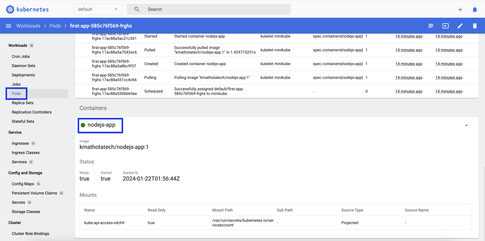

**NOTE:**
- Here It won't work if you use the same image name. You need to use a different image name. Otherwise, Kubernetes will not detect any changes and will not update the deployment.
- Hence, we have used the same image name with a different tag.

```
docker build -t <docker-hub-username>/nodejs-app:v2 .

docker push <docker-hub-username>/nodejs-app:v2
```

```
kubectl set image deployment/first-app nodejs-app=<docker-hub-username>/nodejs-app:v2

deployment.apps/first-app image updated
```

Monitor the rollout status

```
kubectl rollout status deployment/first-app

deployment "first-app" successfully rolled out
```

</details>

<details>
<summary><i>Deployment - Rollback</i></summary>

#### Deployment - Rollback

##### STEP #1: Update the application with a WRONG image

```
kubectl set image deployment/first-app nodejs-app=test/nodejs-app:2

deployment.apps/first-app image updated
```

```
kubectl rollout status deployment/first-app

Waiting for deployment "first-app" rollout to finish: 1 old replicas are pending termination...
```

Here deployment is failed as it was not able to pull the image.


```
kubectl get pods

NAME                         READY   STATUS             RESTARTS      AGE
first-app-585c76f569-frghx   1/1     Running            1 (31m ago)   20h
first-app-5b47c6867b-g5cvm   0/1     ImagePullBackOff   0             4m17s
```

##### STEP#2  : Rollback the deployment

```
kubectl rollout undo deployment/first-app

deployment.apps/first-app rolled back
```

```
kubectl get pods

NAME                         READY   STATUS    RESTARTS      AGE
first-app-585c76f569-frghx   1/1     Running   1 (36m ago)   20h
```

```
kubectl rollout status deployment/first-app

deployment "first-app" successfully rolled out
```

##### STEP#3 : Rollback to a specific revision

```
kubectl rollout history deployment/first-app

deployment.apps/first-app 
REVISION  CHANGE-CAUSE
1         <none>
3         <none>
4         <none>
```

```
kubectl rollout history deployment/first-app --revision=1

deployment.apps/first-app with revision #1
Pod Template:
  Labels:	app=first-app
	pod-template-hash=675d7b94f6
  Containers:
   nodejs-app:
    Image:	test/nodejs-app
    Port:	<none>
    Host Port:	<none>
    Environment:	<none>
    Mounts:	<none>
  Volumes:	<none>
```

##### STEP#4 : Rollback to a specific revision

```
kubectl rollout undo deployment/first-app --to-revision=1

deployment.apps/first-app rolled back
```

</details>

<details>
<summary><i>Deployment - Delete</i></summary>

#### Deployment - Delete

##### STEP #1: Delete the service

```
kubectl delete service first-app

service "first-app" deleted
```

```
kubectl get services 

NAME         TYPE        CLUSTER-IP   EXTERNAL-IP   PORT(S)   AGE
kubernetes   ClusterIP   10.96.0.1    <none>        443/TCP   98d
```

##### STEP #2: Delete the deployment
```
kubectl delete deployment first-app

deployment.apps "first-app" deleted
```

</details>

</details>

<details>
<summary><i>Deployment - Declarative</i></summary>

### Deployment - Declarative

#### Deployment file

##### deployment.yml

```yaml
apiVersion: apps/v1
kind: Deployment
metadata:
  name: second-app-deployment
spec:
  replicas: 2
  template:
    metadata:
      labels:
        app: second-app
    spec:
      containers:
        - name: second-nodejs-app
          image: test/nodejs-app:1
          ports:
            - containerPort: 8080
        #- name: second-nodejs-app2
        #   image: test/nodejs-app2:1
        #   ports:
        #     - containerPort: 8081
```

<details>
<summary><i>Description of YAML fields </i></summary>

###### Description of YAML fields
 
```
apiVersion: Specifies the version of the Kubernetes API that the YAML is built against. In this case, it's using apps/v1, which is a stable version for Deployment objects in Kubernetes.

kind: Defines the type of Kubernetes object being created, which is a Deployment in this case.

metadata: Contains metadata about the Deployment, such as its name (second-app-deployment).

spec: Describes the desired state for the Deployment, including how many replicas of the application should be running, and the template for creating new pods.

  replicas: Specifies the number of pod replicas that should be running at any given time. In this case, it's set to 2, meaning that Kubernetes will ensure that two instances of the pod defined in the template are running.

  template: Defines the pod template, which serves as a blueprint for creating new pods.

    metadata: Contains metadata for the pods created from this template, including labels that can be used for identifying and selecting the pods.

    spec: Specifies the specification for the containers that should be run within the pods created from this template.

      containers: Lists the containers to run within the pod. In this case, there is one container defined:

      name: Specifies the name of the container (second-nodejs-app).

      image: Specifies the Docker image to use for this container (test/nodejs-app:1).

      ports: Specifies the ports that this container exposes. In this case, the container is configured to listen on port 8080.

      The commented-out section represents an alternative container configuration that is not currently active in the Deployment manifest. It's another container definition named second-nodejs-app2 using a different Docker image and port.
```
</details>

#### Selectors

```
kubectl apply -f deployment.yml 
   
error: error validating "deployment.yml": error validating data: ValidationError(Deployment.spec): missing required field "selector" in io.k8s.api.apps.v1.DeploymentSpec; if you choose to ignore these errors, turn validation off with --validate=false
```

`deployment.yml` is missing a required field `selector` within the `spec` section of the Deployment resource. The `selector` field is necessary for the Deployment controller to know which pods it manages and should be part of the Deployment specification.

##### Why selector is required?

  - Will help to identify which other resources are conncted to this resource (i.e. Deployment)
  
  - The Deployment controller uses the selector to determine which Pods to manage. In this case, the selector is `app: second-app`, which means that the Deployment controller will manage any Pod with the `app: second-app` label. Notice that the label selector is the same as the label specified in the pod template.
  
    - `Identifying Managed Pods`: The selector field helps the Deployment controller identify which pods it manages. It uses labels to select the set of pods that the Deployment should manage and maintain according to the desired state specified in the Deployment manifest.

    - `Pod Lifecycle Management`: Kubernetes Deployments use labels and selectors to ensure that the desired number of pods with specific labels are running at any given time. When the Deployment spec is defined, it needs to know which pods to manage, scale, update, or even roll back.

    - `Matching Labels`: The selector field allows the Deployment to match labels specified in the pod template's metadata with those assigned to the pods. This matching is essential for the Deployment controller to determine which pods are part of the application it manages.

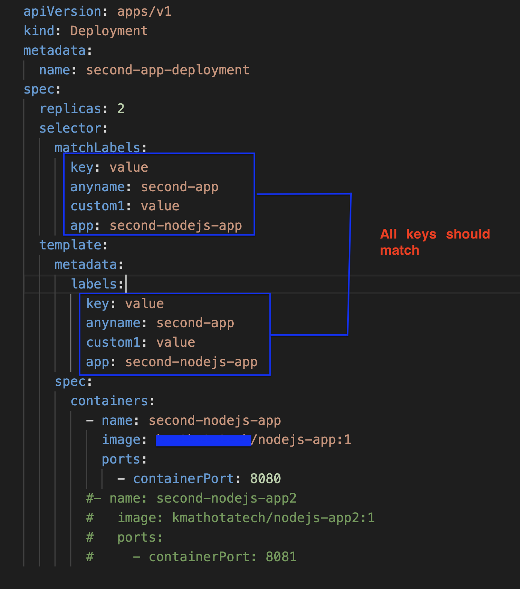

##### Updated file with `selector` field

```yaml
apiVersion: apps/v1
kind: Deployment
metadata:
  name: second-app-deployment
spec:
  replicas: 2
  selector:
    matchLabels:
      key: value
      anyname: second-app
      custom1: value
      app: second-nodejs-app
  template:
    metadata:
      labels:
        key: value
        anyname: second-app
        custom1: value
        app: second-nodejs-app
    spec:
      containers:
        - name: second-nodejs-app
          image: test/nodejs-app:1
          ports:
            - containerPort: 8080
        #- name: second-nodejs-app2
        #   image: test/nodejs-app2:1
        #   ports:
        #     - containerPort: 8081

```

```
kubectl apply -f deployment.yml 

deployment.apps/second-app-deployment created
```

``` 
kubectl get deployments

NAME                    READY   UP-TO-DATE   AVAILABLE   AGE
second-app-deployment   2/2     2            2           7s
```

```
kubectl get pods

NAME                                     READY   STATUS    RESTARTS   AGE
second-app-deployment-5b597695f5-l7l72   1/1     Running   0          12s
second-app-deployment-5b597695f5-znvwx   1/1     Running   0          12s
```

#### Service

Service is not created automatically when you create a deployment. You need to create it manually.

##### Why service is required?

- The Deployment created a set of Pods, but those Pods are not accessible outside the cluster. To make the second-app Pods accessible from outside the Kubernetes virtual network, you need to create a Service.

- A Service is a Kubernetes resource that acts as an internal load balancer. It exposes an application running on a set of Pods as a network service.

- A Service is the standard way to expose a Kubernetes Pod to the outside world. It provides a single, stable IP address that can be used to access the Pods from outside the cluster. The Service also provides a way to identify a set of Pods using labels.

##### Service file

##### service.yml

```yaml
apiVersion: v1
kind: Service
metadata:
  name: backend-service
spec:
  selector:
    app: second-nodejs-app
  ports:
    - protocol: TCP
      port: 8080
      targetPort: 8181
  type: LoadBalancer  
```

In the `selector` field of a Kubernetes Service manifest, you `don't` necessarily need to maintain all the labels that are defined for the pods. Instead, you need to ensure that the labels specified in the selector match the labels assigned to the pods you want the service to target.

For example, if your pods have labels like `app: second-nodejs-app` and `tier: backend`, and you want the Service to target all pods with the `app: second-nodejs-app label`, your Service's selector can simply specify `app: second-nodejs-app`. You don't need to include the `tier: backend` label in the Service's selector unless you specifically want to target pods with that label as well.

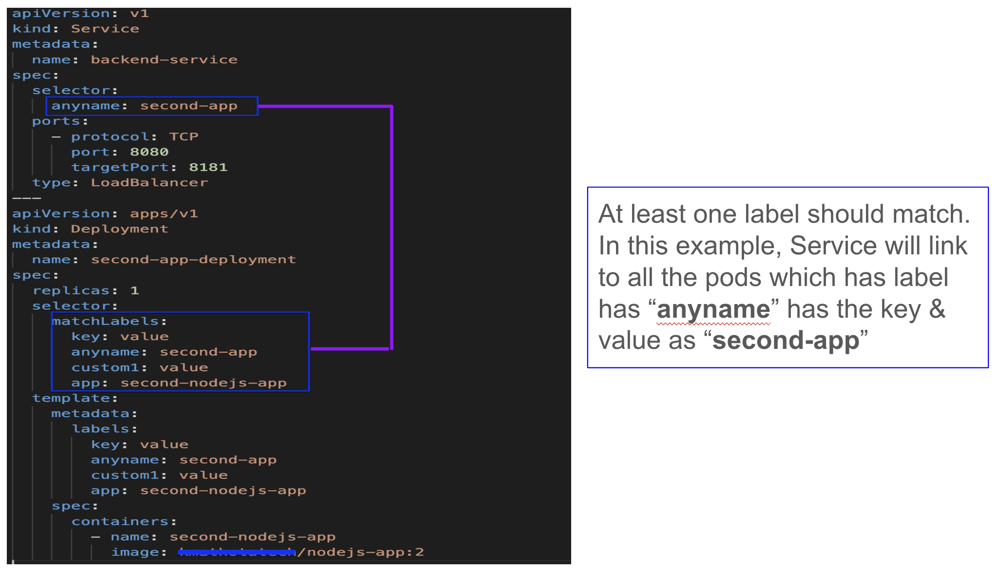

```
kubectl apply -f service.yml 

service/backend-service created
```

```
kubectl get services 

NAME              TYPE           CLUSTER-IP      EXTERNAL-IP   PORT(S)          AGE
backend-service   LoadBalancer   10.100.103.99   <pending>     8080:32035/TCP   8s
kubernetes        ClusterIP      10.96.0.1       <none>        443/TCP          101d
```

```
minikube service backend-service

|-----------|-----------------|-------------|---------------------------|
| NAMESPACE |      NAME       | TARGET PORT |            URL            |
|-----------|-----------------|-------------|---------------------------|
| default   | backend-service |        8080 | http://192.168.49.2:32035 |
|-----------|-----------------|-------------|---------------------------|
🏃  Starting tunnel for service backend-service.
|-----------|-----------------|-------------|------------------------|
| NAMESPACE |      NAME       | TARGET PORT |          URL           |
|-----------|-----------------|-------------|------------------------|
| default   | backend-service |             | http://127.0.0.1:58858 |
|-----------|-----------------|-------------|------------------------|
🎉  Opening service default/backend-service in default browser...
❗  Because you are using a Docker driver on darwin, the terminal needs to be open to run it.
```

When you run `minikube service backend-service`, it creates a tunnel to forward traffic from your local machine to the Docker container running the Minikube cluster. This tunneling mechanism allows you to access services running within the Minikube cluster as if they were running locally.

The tunneling process is necessary because the services running within the Minikube cluster are not directly accessible from your local machine's network. By setting up the tunnel, Minikube provides a convenient way for you to access these services using a local URL, simplifying the development and testing process.

#### Update the deployment

Simply update required fields in the deployment file and apply it.

```
kubectl apply -f deployment.yml

deployment.apps/second-app-deployment configured
```

#### Delete the deployment and service

```
kubectl delete -f=deployment.yml -f=service.yml 

deployment.apps "second-app-deployment" deleted
service "backend-service" deleted
```

```
kubectl get deployments 

No resources found in default namespace.
```

```
kubectl get pods

No resources found in default namespace.
```

```
kubectl get services

NAME         TYPE        CLUSTER-IP   EXTERNAL-IP   PORT(S)   AGE
kubernetes   ClusterIP   10.96.0.1    <none>        443/TCP   102d
```

#### Single fle for deployment and service

##### deployment-master.yml


```yaml
apiVersion: v1
kind: Service
metadata:
  name: backend-service
spec:
  selector:
    anyname: second-app
  ports:
    - protocol: TCP
      port: 8080
      targetPort: 8181
  type: LoadBalancer
---
apiVersion: apps/v1
kind: Deployment
metadata:
  name: second-app-deployment
spec:
  replicas: 1
  selector:
    matchLabels:
      key: value
      anyname: second-app
      custom1: value
      app: second-nodejs-app
  template:
    metadata:
      labels:
        key: value
        anyname: second-app
        custom1: value
        app: second-nodejs-app
    spec:
      containers:
        - name: second-nodejs-app
          image: test/nodejs-app:2
```

```
kubectl apply -f deployment-master.yml

service/backend-service configured
```

```
kubectl get deployments 
NAME                    READY   UP-TO-DATE   AVAILABLE   AGE
second-app-deployment   1/1     1            1           22h
```

```
kubectl get pods
NAME                                     READY   STATUS    RESTARTS       AGE
second-app-deployment-688b7674c9-9t4vd   1/1     Running   1 (113s ago)   22h
```

```
kubectl get services

NAME              TYPE           CLUSTER-IP      EXTERNAL-IP   PORT(S)          AGE
backend-service   LoadBalancer   10.108.25.205   <pending>     8080:31103/TCP   22h
kubernetes        ClusterIP      10.96.0.1       <none>        443/TCP          102d
```

</details>

<details>
<summary><i>Probes</i></summary>

## Probes

### Liveness Probe

- The Liveness Probe checks whether a container is still running and healthy.
- If the Liveness Probe fails, Kubernetes restarts the container to try to restore it to a healthy state.
- The Liveness Probe is essential for ensuring that containers are continuously available and responsive.
  
### Readiness Probe

- The Readiness Probe determines whether a container is ready to serve requests.
- It helps Kubernetes determine when a container is ready to start accepting traffic.
- If the Readiness Probe fails, Kubernetes removes the container's IP address from the endpoints of services and replication controllers, preventing it from receiving traffic.
- The Readiness Probe ensures that only healthy containers receive requests, helping to maintain the overall stability and reliability of the application

```yaml
apiVersion: apps/v1
kind: Deployment
metadata:
  name: second-app-deployment
spec:
  replicas: 1
  selector:
    matchLabels:
      key: value
      anyname: second-app
      custom1: value
      app: second-nodejs-app
  template:
    metadata:
      labels:
        key: value
        anyname: second-app
        custom1: value
        app: second-nodejs-app
    spec:
      containers:
        - name: second-nodejs-app
          image: kmathotatech/nodejs-app:1
          livenessProbe:
            httpGet:
              path: /
              port: 8181
            initialDelaySeconds: 5
            periodSeconds: 5
            timeoutSeconds: 1
            failureThreshold: 3
            successThreshold: 1
```

If liveless probe fails, then kubernetes will restart the container.

```
kubectl get pods

NAME                                    READY   STATUS    RESTARTS     AGE
second-app-deployment-fbc44dbc5-qzxxq   1/1     Running   5 (1s ago)   101s
```

```
kubectl describe pod second-app-deployment-fbc44dbc5-qzxxq

Name:             second-app-deployment-fbc44dbc5-qzxxq
Namespace:        default
Priority:         0
Service Account:  default
Node:             minikube/192.168.49.2
Start Time:       Sat, 27 Jan 2024 14:28:16 -0600
Labels:           anyname=second-app
                  app=second-nodejs-app
                  custom1=value
                  key=value
                  pod-template-hash=fbc44dbc5
Annotations:      <none>
Status:           Running
IP:               172.17.0.6
IPs:
  IP:           172.17.0.6
Controlled By:  ReplicaSet/second-app-deployment-fbc44dbc5
Containers:
  second-nodejs-app:
    Container ID:   docker://ba67b5b2beaa644898b2c710fd4ce6ceea8b0d89e7cd23e968a9d39b27fb1abd
    Image:          kmathotatech/nodejs-app:1
    Image ID:       docker-pullable://kmathotatech/nodejs-app@sha256:44cc18db1a16c78b49a643d684ab95f34622b615a332e40ab2c803cbf3a5030f
    Port:           <none>
    Host Port:      <none>
    State:          Waiting
      Reason:       CrashLoopBackOff
    Last State:     Terminated
      Reason:       Completed
      Exit Code:    0
      Started:      Sat, 27 Jan 2024 14:30:06 -0600
      Finished:     Sat, 27 Jan 2024 14:30:21 -0600
    Ready:          False
    Restart Count:  5
    Liveness:       http-get http://:8181/health delay=5s timeout=1s period=5s #success=1 #failure=3
    Environment:    <none>
    Mounts:
      /var/run/secrets/kubernetes.io/serviceaccount from kube-api-access-7x8q4 (ro)
Conditions:
  Type              Status
  Initialized       True 
  Ready             False 
  ContainersReady   False 
  PodScheduled      True 
Volumes:
  kube-api-access-7x8q4:
    Type:                    Projected (a volume that contains injected data from multiple sources)
    TokenExpirationSeconds:  3607
    ConfigMapName:           kube-root-ca.crt
    ConfigMapOptional:       <nil>
    DownwardAPI:             true
QoS Class:                   BestEffort
Node-Selectors:              <none>
Tolerations:                 node.kubernetes.io/not-ready:NoExecute op=Exists for 300s
                             node.kubernetes.io/unreachable:NoExecute op=Exists for 300s
Events:
  Type     Reason     Age                   From               Message
  ----     ------     ----                  ----               -------
  Normal   Scheduled  2m20s                 default-scheduler  Successfully assigned default/second-app-deployment-fbc44dbc5-qzxxq to minikube
  Normal   Pulled     91s (x4 over 2m20s)   kubelet            Container image "kmathotatech/nodejs-app:1" already present on machine
  Normal   Created    91s (x4 over 2m20s)   kubelet            Created container second-nodejs-app
  Normal   Started    91s (x4 over 2m20s)   kubelet            Started container second-nodejs-app
  Normal   Killing    91s (x3 over 2m1s)    kubelet            Container second-nodejs-app failed liveness probe, will be restarted
  Warning  Unhealthy  86s (x10 over 2m11s)  kubelet            Liveness probe failed: HTTP probe failed with statuscode: 404

```

</details>

<details>
<summary><i>References</i></summary>

## References

Kubernetes Tutorials

https://www.aquasec.com/cloud-native-academy/kubernetes-101/kubernetes-tutorials-2/

API Reference:
https://kubernetes.io/docs/reference/

</details>

